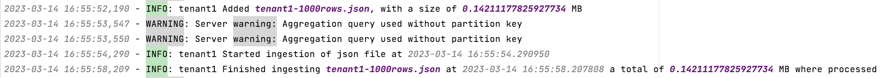

# This your assignment report

It is a free form. you can add:

* your designs
* your answers to questions in the assignment
* your test results
* etc.

## Part 1 - Batch data ingestion pipeline

The design for the batch data ingestion is the following:


Each tenant will generate its own files, then they will use its clientbatchingestapp to send its files to mysimbdp client-staging-input-folder. Each tenant will name its files using an identifier. Then mysimbdp will process the files in the staging folder, it will check the tenant configuration model to define if the files are correct. Then it will ingest them to coredms.

1. As platform provider I will require the following constraints to be followed.
   1. __File size limit__: up to 50 MB, use MB notation.
   2. __File type__: only CSV and JSON files are supported, they cannot be mixed.
   3. __Maximum amount of data__: 1 GB per day, use MB notation
   4. __Maximum number of files__: up to 1000 files per day not exceeding the maximum amount of data (i.e. 1000 files of 1KB, 20 files of 50MB)
  
   This information will be retrieved when the tenant when they hire the service. 
As provider, I will have a file with every tenant configuration, so I can easily add and remove tenants. 
   I will also ask for the fields that they will store in coredms, so I can add the schema in the configuration file. This will allow me to automate 
   the creation of namespaces and tables when I add a new tenant.
   The previously mentioned constraints will benefit the tenant while maintaining mysimbdp functional for the following reasons:
      * By setting the amount and size of files I can ensure that all resources are allocated  fairly for all tenants.
      * By setting amount of data per day I can make sure that my system will not be overloaded and I will ensure that each file is ingested efficiently.
      * By setting the file type I can guarantee tenants that I know how to work with them, not promising type files I have not used before.
      * By setting limits on the amount of data that can be ingested, tenants ensure they are only paying for the resources they need and not exceeding their allocated budget.
   
   The following configuration file sets two tenants with different needs:
   ```json
   {
   "tenant1": {
     "max_file_size": 10,
     "file_type": ".json",
     "max_amount_of_data": 500,
     "max_number_of_files": 50,
     "namespace": "tenant1",
     "table_name": "comments_upvotes_by_subreddit",
     "schema": {
       "created_utc": "timestamp",
       "ups": "int",
       "subreddit": "text",
       "id": "text",
       "author": "text",
       "score": "int",
       "key": "((subreddit, id), ups)"
     }
   },
    "tenant2": {
        "max_file_size": 50,
        "file_type": ".csv",
        "max_amount_of_data": 1000,
        "max_number_of_files": 20,
        "namespace": "tenant2",
        "table_name": "comments_by_subreddit",
        "schema": {
          "created_utc": "timestamp",
          "subreddit": "text",
          "id": "text",
          "author": "text",
          "body": "text",
          "key": "((subreddit, id), author)"
        }
      }
   }
   ```
   _Tenant 1_ will have smaller files and needs less space for their files because they only analyze the up votes of comments in 
different subreddits to reach out to authors for marketing purposes. 
On the other hand, _tenant 2_ needs bigger files and more space because they do sentiment analysis of the body of comments, which are sometimes really long. Usually csv files are smaller than json, that is why they chose that format.
2. As tenant, I will process the data obtained from the reddit API _(assumption, data will be in original-client-data)_ 
and will delete the fields that are not relevant to me, then using my clientbatchingestapp I will send files to the 
provider.
   * Tenant 1: I keep only this fields, __created_utc__ timestamp, __ups__ int, __subreddit__ text, __id__ text, __author__ text, __score__ int.
   Because that information is relevant to me. I design marketing deals for popular authors.
   * Tenant 2: I keep only this fields, __created_utc__ timestamp, __subreddit__ text, __id__ text, __author__ text, __body__ text.
   This information is relevant to me because I process the content of the comments to do sentiment analysis for research purposes.
3. As a provider, I have a [configuration file](../code/mysimbdp/batchingestmanager/config_model.json) that includes all my tenant's models, I keep track of how much data they have ingested,
   how many files, the format they need, among other things (explained in question 1). I don't know how my tenants
   process their information, but I require that the files that arrive to my client-staging-input-directory have a prefix that matches
   the tenant namespace and that they do not exceed the limits set in their model.
   I have a watchdog monitor in my folder which will notify my system when there is a new file to be ingested, the file will be processed and inserted into the
   database unless the file is exceeding any of the requirements. This is done by checking their total files and amount of data ingested that day, this information
   is stored in their namespace in a table called batch_ingestion_metrics.
4. * Shared parts among tenants:
      1. coredms - It is a Cassandra cluster.
      2. client-staging-input-directory - A folder to which tenants will upload their data files.

   * Dedicated for each tenant:
      1. batchingestmanager - According to the parameters in the configuration model, the manager will ingest data diferently to coredms.
      2. namespace - Each tenant will have a separate namespace in coredms.

   * There are two clientbatchingestapp to test. 
     * The first one is in the folder [client1](../code/client1). 
     
     This client simply cleans its data to send only the rows they need in a json format. 
     The file arrives to [mysimbdp-batchingestmanager](../code/mysimbdp/batchingestmanager/batchingestmanager.py) and there it gets validated
      against the configuration model that corresponds to tenant1, if the file is json, under 10 MB, the amount of data inserted
      that day is less than 500 MB, and also the number of files inserted that day is less than 50 then the data gets processed as json and gets inserted
      into coredms. If any of these constraints fail, the ingestion does not proceed.
     
     * The second one is in the folder [client2](../code/client1)
     
     This client simply cleans its data to send only the rows they need in a csv format. 
     The file arrives to [mysimbdp-batchingestmanager](../code/mysimbdp/batchingestmanager/batchingestmanager.py) and there it gets validated
      against the configuration model that corresponds to tenant2, if the file is csv, under 50 MB, the amount of data inserted
      that day is less than 1000 MB, and also the number of files inserted that day is less than 20 then the data gets processed as csv and gets inserted
      into coredms. If any of these constraints fail, the ingestion does not proceed.
 
     * Here are screenshots of the logs in [ingestion.log](../logs/ingestion.log) when the constraints fail, they were modified to smaller constraints, so they fail faster.
     
     
     

    > __NOTE:__ It is important to mention that none of the clients are receiving any confirmation message of the ingestion. However, this might get solved with the metrics. They could have a dashboard to check the logs of their namespace in mysimbdp.

5. I am currently saving data related to ingestion (success and failures) in the [ingestion.log](../logs/ingestion.log) file. I am logging:
   1. The beginning of the ingestion
   2. The end of ingestion
   3. The size of the file ingested
   4. Errors in the validation of constraints
   5. Errors during ingestion to Cassandra
   
   A successful ingestion looks like this:
   
   
    A failed ingestion for validation was shown previously.

    I am also saving data in each tenant's name space, in the table batch_ingestion_metrics. I use that information to check if
    any tenant have exceeded the daily amount of data they paid for, and to get metrics on performance.
    1. The beginning of the ingestion
    2. The end of ingestion
    3. The name of the file ingested
    4. The size of the file ingested
   
    Some stored data look like this:
    
    
    
    This information can be useful to tenants too. They can monitor their daily data ingestion, so they can decide to pay for more capabilities. Also, to keep
    track of the files that were successfully ingested, and those that weren't, so they can send them again.
    