# This your assignment report

It is a free form. you can add:

* your designs
* your answers to questions in the assignment
* your test results
* etc.

## Part 1 - Batch data ingestion pipeline

The design for the batch data ingestion is the following:

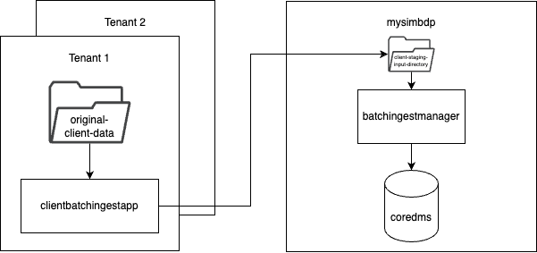

Each tenant will generate its own files, then they will use its clientbatchingestapp to send its files to mysimbdp client-staging-input-folder. Each tenant will name its files using an identifier. Then mysimbdp will process the files in the staging folder, it will check the tenant configuration model to define if the files are correct. Then it will ingest them to coredms.

1. As platform provider I will require the following constraints to be followed.
   1. __File size limit__: up to 50 MB, use MB notation.
   2. __File type__: only CSV and JSON files are supported, they cannot be mixed.
   3. __Maximum amount of data__: 1 GB per day, use MB notation
   4. __Maximum number of files__: up to 1000 files per day not exceeding the maximum amount of data (i.e. 1000 files of 1KB, 20 files of 50MB)
  
   This information will be retrieved when the tenant when they hire the service. 
As provider, I will have a file with every tenant configuration, so I can easily add and remove tenants. 
   I will also ask for the fields that they will store in coredms, so I can add the schema in the configuration file. This will allow me to automate 
   the creation of namespaces and tables when I add a new tenant.
   The previously mentioned constraints will benefit the tenant while maintaining mysimbdp functional for the following reasons:
      * By setting the amount and size of files I can ensure that all resources are allocated  fairly for all tenants.
      * By setting amount of data per day I can make sure that my system will not be overloaded and I will ensure that each file is ingested efficiently.
      * By setting the file type I can guarantee tenants that I know how to work with them, not promising type files I have not used before.
      * By setting limits on the amount of data that can be ingested, tenants ensure they are only paying for the resources they need and not exceeding their allocated budget.
   
   The following configuration file sets two tenants with different needs:
   ```json
   {
   "tenant1": {
     "max_file_size": 10,
     "file_type": ".json",
     "max_amount_of_data": 500,
     "max_number_of_files": 50,
     "namespace": "tenant1",
     "table_name": "comments_upvotes_by_subreddit",
     "schema": {
       "created_utc": "timestamp",
       "ups": "int",
       "subreddit": "text",
       "id": "text",
       "author": "text",
       "score": "int",
       "key": "((subreddit, id), ups)"
     }
   },
    "tenant2": {
        "max_file_size": 50,
        "file_type": ".csv",
        "max_amount_of_data": 1000,
        "max_number_of_files": 20,
        "namespace": "tenant2",
        "table_name": "comments_by_subreddit",
        "schema": {
          "created_utc": "timestamp",
          "subreddit": "text",
          "id": "text",
          "author": "text",
          "body": "text",
          "key": "((subreddit, id), author)"
        }
      }
   }
   ```
   _Tenant 1_ will have smaller files and needs less space for their files because they only analyze the up votes of comments in 
different subreddits to reach out to authors for marketing purposes. 
On the other hand, _tenant 2_ needs bigger files and more space because they do sentiment analysis of the body of comments, which are sometimes really long. Usually csv files are smaller than json, that is why they chose that format.
2. As tenant, I will process the data obtained from the reddit API _(assumption, data will be in original-client-data)_ 
and will delete the fields that are not relevant to me, then using my clientbatchingestapp I will send files to the 
provider.
   * Tenant 1: I keep only this fields, __created_utc__ timestamp, __ups__ int, __subreddit__ text, __id__ text, __author__ text, __score__ int.
   Because that information is relevant to me. I design marketing deals for popular authors.
   * Tenant 2: I keep only this fields, __created_utc__ timestamp, __subreddit__ text, __id__ text, __author__ text, __body__ text.
   This information is relevant to me because I process the content of the comments to do sentiment analysis for research purposes.
3. As a provider, I have a [configuration file](../code/mysimbdp/batchingestmanager/config_model.json) that includes all my tenant's models, I keep track of how much data they have ingested,
   how many files, the format they need, among other things (explained in question 1). I don't know how my tenants
   process their information, but I require that the files that arrive to my client-staging-input-directory have a prefix that matches
   the tenant namespace and that they do not exceed the limits set in their model.
   I have a watchdog monitor in my folder which will notify my system when there is a new file to be ingested, the file will be processed and inserted into the
   database unless the file is exceeding any of the requirements. This is done by checking their total files and amount of data ingested that day, this information
   is stored in their namespace in a table called batch_ingestion_metrics.
4. * Shared parts among tenants:
      1. coredms - It is a Cassandra cluster.
      2. client-staging-input-directory - A folder to which tenants will upload their data files.

   * Dedicated for each tenant:
      1. batchingestmanager - According to the parameters in the configuration model, the manager will monitor the shared folder to find each tenant's files and ingest data differently to coredms.
      2. namespace - Each tenant will have a separate namespace in coredms.

   * There are two clientbatchingestapp to test. 
     * The first one is in the folder [client1](../code/client1). 
     
     This client simply cleans its data to send only the rows they need in a json format. 
     The file arrives to [mysimbdp-batchingestmanager](../code/mysimbdp/batchingestmanager/batchingestmanager.py) and there it gets validated
      against the configuration model that corresponds to tenant1, if the file is json, under 10 MB, the amount of data inserted
      that day is less than 500 MB, and also the number of files inserted that day is less than 50 then the data gets processed as json and gets inserted
      into coredms. If any of these constraints fail, the ingestion does not proceed.
     
     * The second one is in the folder [client2](../code/client1)
     
     This client simply cleans its data to send only the rows they need in a csv format. 
     The file arrives to [mysimbdp-batchingestmanager](../code/mysimbdp/batchingestmanager/batchingestmanager.py) and there it gets validated
      against the configuration model that corresponds to tenant2, if the file is csv, under 50 MB, the amount of data inserted
      that day is less than 1000 MB, and also the number of files inserted that day is less than 20 then the data gets processed as csv and gets inserted
      into coredms. If any of these constraints fail, the ingestion does not proceed.
 
     * Here are screenshots of the logs in [ingestion.log](../logs/ingestion_batch.log) when the constraints fail, they were modified to smaller constraints, so they fail faster.
     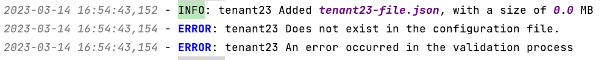
     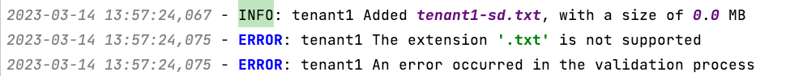
     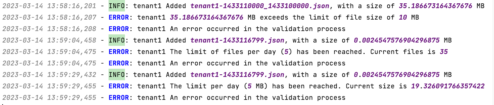

    > __NOTE:__ It is important to mention that none of the clients are receiving any confirmation message of the ingestion. However, this might get solved with the metrics. They could have a dashboard to check the logs of their namespace in mysimbdp.
   * To test performance I created two scripts, one based in messages per second and another one based in files/size/second. Here are some results after some ingestions:
    ```
   Number of messages processed: 3000 by tenant1
   Minimum time taken to process a message: 0.000967 seconds by tenant1
   Maximum time taken to process a message: 0.436384 seconds by tenant1
   Average time taken to process a message: 0.0022287446666666667 seconds by tenant1
   ```
   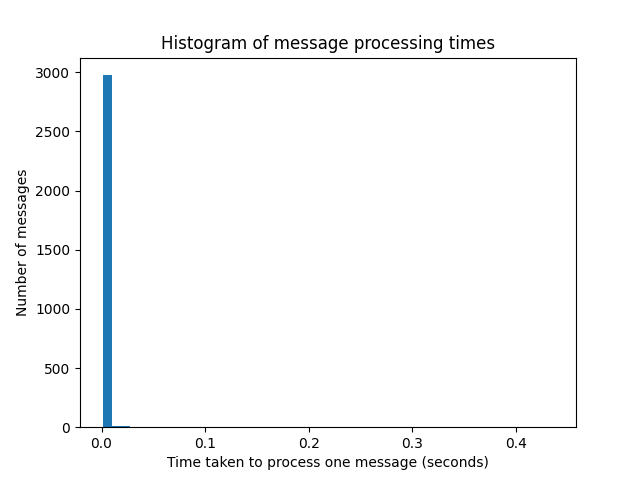
    ```
   Number of files processed: 3 by tenant1
   Minimum time taken to process a file: 4.29036 seconds by tenant1
   Maximum time taken to process a file: 4.500693 seconds by tenant1
   Average time taken to process a file: 4.409771666666667 seconds by tenant1
   Minimum file size: 0.1420755386352539 seconds by tenant1
   Maximum file size: 0.14217662811279297 seconds by tenant1
   Average file size: 0.1421213150024414 seconds by tenant1
   ```
   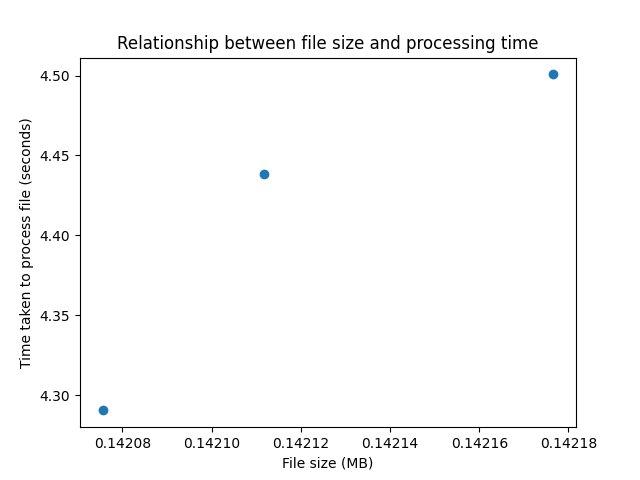
   ```
   Number of messages processed: 20000 by tenant2
   Minimum time taken to process a message: 0.000895 seconds by tenant2
   Maximum time taken to process a message: 0.457415 seconds by tenant2
   Average time taken to process a message: 0.0022362127 seconds by tenant2
   ```
   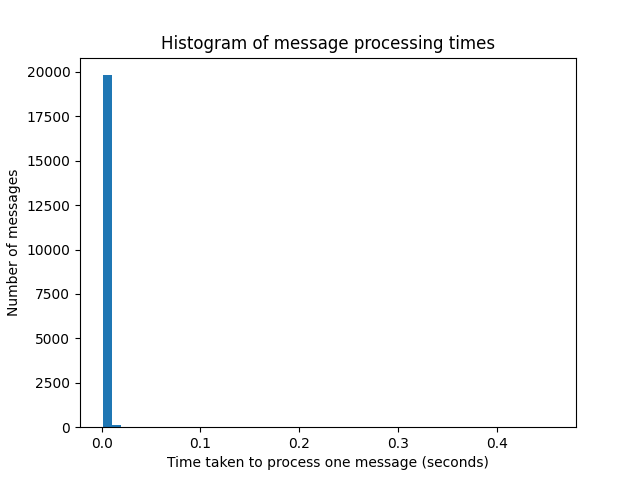
   ```
   Number of files processed: 2 by tenant2
   Minimum time taken to process a file: 45.4919 seconds by tenant2
   Maximum time taken to process a file: 45.573657 seconds by tenant2
   Average time taken to process a file: 45.5327785 seconds by tenant2
   Minimum file size: 1.8295812606811523 seconds by tenant2
   Maximum file size: 1.8295812606811523 seconds by tenant2
   Average file size: 1.8295812606811523 seconds by tenant2
   ```
   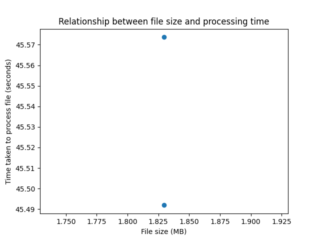
    
    I can see that the messages that have body take slightly more time than those who does not contain that part. Also, ingestion in csv is done the traditional
    why, while json ingestion is done by using the complete structure.

5. I am currently saving data related to ingestion (success and failures) in the [ingestion_batch.log](../logs/ingestion_batch.log) file. I am logging:
   1. The size of the ingested file
   2. The time taken to ingest one record
   3. The time taken to ingest the complete file
   4. Errors in the validation of constraints (as shown in question 4)
   5. Errors during ingestion to Cassandra
   
   A successful ingestion looks like this:
   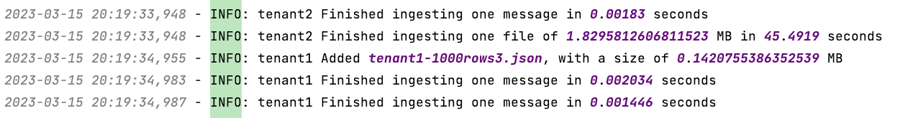
   
    A failed ingestion for validation was shown previously.

    I am also saving data in each tenant's name space, in the table batch_ingestion_metrics. I use that information to check if
    any tenant has exceeded the daily amount of data they paid for.
    1. The beginning of the ingestion
    2. The end of ingestion
    3. The name of the file ingested
    4. The size of the file ingested
   
    Some stored data look like this:
    
    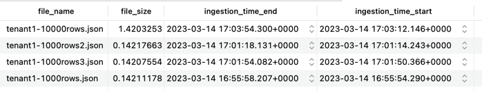
    
    This information could be useful to tenants too if a report is given. They can monitor their daily data ingestion, so they can decide to pay for more capabilities. Also, to keep
    track of the files that were successfully ingested, and those that weren't, so they can send them again.


## Part 2 - Near-realtime data ingestion

The design for the stream data ingestion is the following:

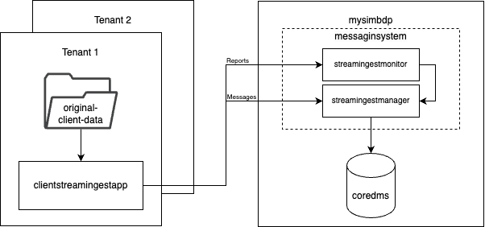

Each tenant will generate its own messages, they will use its clientstreamingestapp to send messages to mysimbdp messaginsystem.
The messaging sysmtem has two modules, streamingestmonitor and streamingestmanager. Tenants will send reports with metrics to the monitor
and messages with data to ingest to the manager, which will store the messages in coredms.

The messaging system used for the communication is Kafka. Each tenant uses a producer to send messages to mysimbdp. I could have also
used an API to send individual messages, however I focused on this implementation. 
There is a dedicated consumer (or more if needed, just increment the partitions) to process incoming messages from tenants and ingest them to coredms.
Both consumers and producers will use the same topic according to the tenant that is sending the data.

1. * Shared parts among tenants:
     * coredms - It is a Cassandra cluster. 
     * messaging system - Each tenant will send messages to the same messaging system.
   * Dedicated for each tenant:
     * topics in the messaging system - Each tenant will send messages with a topic, which will allow the manager to send the message to the correspondant namespace.
     * consumer of the messages - Each tenant will have a dedicated consumer (or more) which will ingest their data to coredms.
     * namespace - Each tenant will have a separate namespace in coredms.
   * Add/remove tenants:
     * This is simply done by stop ingesting messages for said tenant. The decision can be made according to the metrics of each tenant.
       If they paid for 5000 messages a day when they exceed that quota no more messages will be ingested to coredms until they add more messages to
       the quota, or wait for the next day. If a tenant does not want the service anymore it will be removed from the configuration models and its consumers will be shut down.
2. The following model needs to be followed by all tenants. They have to tell me how many messages they will process every day. Also, they need to
provide me with their table name and fields so the schema can be created accordingly in their namespace in coredms.

    ```json
       {
       "tenant1": {
         "max_messages_per_day": 1000,
         "namespace": "tenant1",
         "table_name": "comments_upvotes_by_subreddit",
         "schema": {
           "created_utc": "timestamp",
           "ups": "int",
           "subreddit": "text",
           "id": "text",
           "author": "text",
           "score": "int",
           "key": "((subreddit, id), ups)"
         }
       },
        "tenant2": {
            "max_messages_per_day": 100,
            "namespace": "tenant2",
            "table_name": "comments_by_subreddit",
            "schema": {
              "created_utc": "timestamp",
              "subreddit": "text",
              "id": "text",
              "author": "text",
              "body": "text",
              "key": "((subreddit, id), author)"
            }
          }
       }
    ```
    As __provider__, it is not relevant to me how they send their messages. If they exceed the quota the streamingestmanager will not
    process them and will save that information to a log file, so they can later decide if they want more messages to be processed per day.
    The message they send needs to follow the schema they have provided, and have to be sent to a topic that matches the namespace too. 
    Any message that is not following the schema and/or is not sent to the correct topic won't be processed.

    As __tenant1__, I am sending my data which is stored in json files as json messages. I clean the data and select only the fields I
    require. I provided my schema to the provider.

    As __tenant2__, I am sending my data which is stored in csv files as json messages. I transform csv rows to json objects with only
    the fields that are relevant for me. Some contents of the reddit comments might include special characters like parentheses or
    brackets, I acknowledge that those messages will be lost during ingestion.
3. The time it takes a message to get ingested to coredms is logged into [ingestion_stream.log](../logs/ingestion_batch.log). All errors are also
    written. For example, if a tenant exceeds their quota, then errors like this will be shown in the log:

    
    If an error occurs during ingestion it will also be shown.
    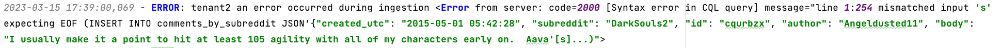
    On the other hand, correct ingestion looks like this:
    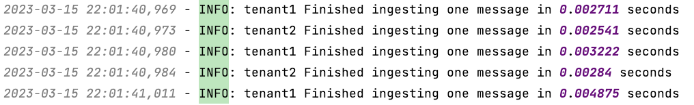

    For testing tenant1 I am using json files that get transformed into json messages and sent to the consumer.
    
    For testing tenant2 I am using csv files that get transformed into json messages and sent to the consumer.

    The results of the performance tests for each tenant are the following:
    ```
   Number of messages processed: 2000 by tenant1
   Minimum time taken to process a message: 0.001111 seconds by tenant1
   Maximum time taken to process a message: 0.0465 seconds by tenant1
   Average time taken to process a message: 0.0033423105 seconds by tenant1
   ```
   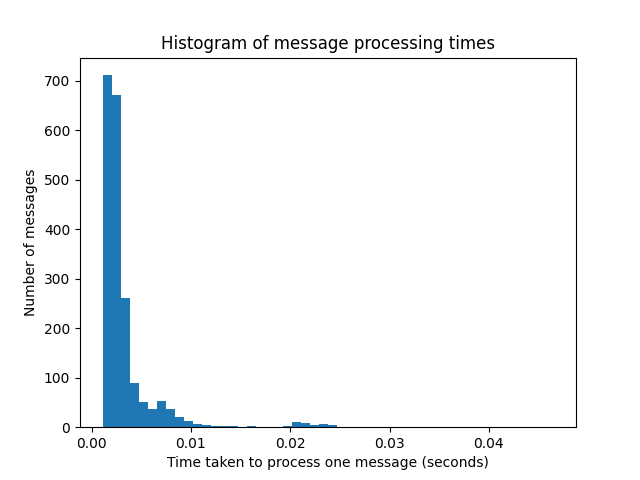
    ```
   Number of messages processed: 1125 by tenant2
   Minimum time taken to process a message: 0.001224 seconds by tenant2
   Maximum time taken to process a message: 0.032488 seconds by tenant2
   Average time taken to process a message: 0.003615905777777778 seconds by tenant2
   ```
   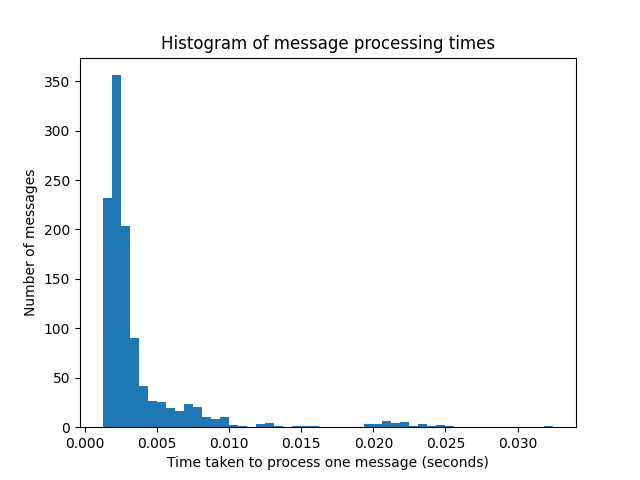

    And for all:
    ```
   Number of messages processed: 3125 by all
   Minimum time taken to process a message: 0.001111 seconds by all
   Maximum time taken to process a message: 0.0465 seconds by all
   Average time taken to process a message: 0.0034408048 seconds by all
   ```
   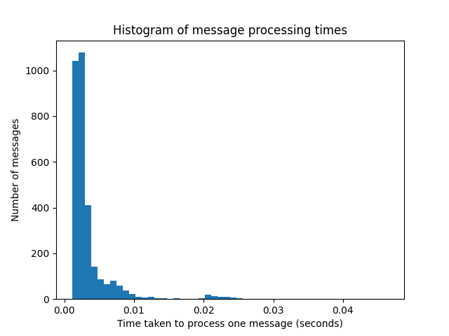

    The maximum throughput possible is 54005 messages per second, if we take the minimum time
    it took to process one single message, however, this condition will only be met if all messages
    share the characteristic of that one that gave that statistic.
    
    A more reasonable metric could be an average throughput of 17438 messages per second if we use
    the average time taken for a message to be processed.
4. Tenants will send statistics on the data they send to the messaging system every day, as it matches the schema 
    of pricing. For doing that they will send a message over a dedicated topic for statistics to streamingestmonitor (the analysis of
    the report is explained in next question). The message will have the following structure:
    ```json
   {
    "date": "2023-03-16",
   "avg_ingestion_time": 0.002,
   "total_messages": 15000
   }
   ```
   Where the time is measured in seconds. That information will be gathered from the logs of the clientstreamingestapp. 
    This could definitely be automated, however for now the report will be done manually.
5. TBD

## Part 3 - Integration and Extension

1. To support this feature I would simply change the log file in the arguments of both batch and stream systems, so they
    store data in the same place. Then I would simply run the tests I already have with the name of the desired tenant
    and would get the result from both batch and stream by message and by file. I could also get cumulative data for all my tenants.
2. One solution could be to use a different topic specifying the sink, then I would adjust my consumer to send data from that
    topic to the correspondant sink.
    The tenant then would need to run the producer twice for each topic (that specifies the sink).
    
    Another option could be to receive an extra parameter in the message so that I could check if that particular message
    needs to go to one or many sinks. With this approach the tenant doesn't need to send the message twice.

    For example, a json message could be modified as follows:
    ```json
   {
   "sink" : ["coredms", "alternate_sink"],
   "message": {
      "created_utc": "2015-05-01 05:44:32",
      "ups": 13, 
      "subreddit": "bleach", 
      "id": "cqurdgl", 
      "author": "ciddark", 
      "score": 13
      }
   }
   ```
3. One simple option for tenants that send json messages could be to use [bson](https://bsonspec.org/#/specification) instead, 
which transforms the data to binary, then the receiver can store it like that or transform it back. However, this is not encryption.
But if they only want a low level of security this could work.

    If they need more security then I would recommend to use a secured connection to interact with kafka, right now it is configured to accept "plain text" 
instead of SSL. 

    For files, it would be also possible to have shared certificates to encrypt and decrypt, so only the tenant and provider can visualize the
    contents.
4. i. To measure quality of reddit comments I would ask my tenants on what is the characteristic they want to measure. So I can add it to the 
    model. For example, maybe tenant 1 would like to check only comments that have up votes above a certain number, let's say 50 upvotes. All 
    the comments that have less than that could be then discarded. For tenant 2, there is something already happening, all those messages that
    include parenthesis and square brackets are not getting ingested because they mess up the system, so that data is not valuable for them. Even though
    there is not a real filter it is already being excluded.

    ii. To store metadata I could  automate a script that runs daily and checks the logs to see the authors with most voted comments and store it in a metadata
    table for tenant 1. For tenant 2 I would store those authors that have more wrongly formatted messages. I could simply do a similar strategy
    of the one I'm using to get statistics, but look for different patterns in the logs.
5. To extend my design to support different file types I would modify the constraints in the configuration model,
so instead of allowing only one file type they could use more. I would also need to implement support in my batchingestmanager for
other file types such as txt.

    It would be something like this:
    ```json
   {
   "tenant1": {
     "max_file_size": 10,
     "file_type": [".json",".txt",".csv"],
     "max_amount_of_data": 500,
     "max_number_of_files": 50,
     "namespace": "tenant1",
     "table_name": "comments_upvotes_by_subreddit",
     "schema": {
       "created_utc": "timestamp",
       "ups": "int",
       "subreddit": "text",
       "id": "text",
       "author": "text",
       "score": "int",
       "key": "((subreddit, id), ups)"
     }
   },
    "tenant2": {
        "max_file_size": 50,
        "file_type": [".csv", ".json"],
        "max_amount_of_data": 1000,
        "max_number_of_files": 20,
        "namespace": "tenant2",
        "table_name": "comments_by_subreddit",
        "schema": {
          "created_utc": "timestamp",
          "subreddit": "text",
          "id": "text",
          "author": "text",
          "body": "text",
          "key": "((subreddit, id), author)"
        }
      }
   }
   ```
   Additionally, for different workloads I could add some kind of job mechanism, so those files that require more time to process
could be processed later when there is not much activity. They could also be processed in parts, so they don't take all the resources at once.
